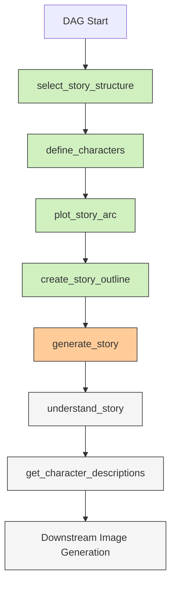

# Chain of Thought Story Generation Plan

## Overview

This document outlines the implementation plan for enhancing the story generation process in the `generate_book` DAG by adding chain-of-thought reasoning. The goal is to produce more coherent and well-planned stories by adding several planning steps before generating the final story.

## Current vs. Enhanced Workflow

The current workflow generates a story directly from a description, while the enhanced workflow will:
1. Plan the story structure
2. Define characters
3. Create a plot arc
4. Develop a paragraph-by-paragraph outline
5. Generate the full story based on this detailed planning

## New DAG Structure



## Detailed Implementation

### 1. Task: `select_story_structure`

This task randomly selects a story structure to guide the narrative.

```python
@task
def select_story_structure(dag_run):
    import random
    
    # Define various story structures
    story_structures = [
        {
            "name": "Hero's Journey",
            "description": "A character goes on an adventure, faces challenges, and returns transformed",
            "elements": [
                "Ordinary World",
                "Call to Adventure",
                "Meeting the Mentor",
                "Crossing the Threshold",
                "Tests, Allies, and Enemies",
                "The Ordeal",
                "Reward",
                "Return with the Elixir"
            ]
        },
        {
            "name": "Three-Act Structure",
            "description": "Setup, confrontation, and resolution",
            "elements": [
                "Exposition",
                "Inciting Incident",
                "Rising Action",
                "Midpoint",
                "Complications",
                "Climax",
                "Resolution"
            ]
        },
        {
            "name": "Problem-Solution",
            "description": "Character faces a problem and finds a solution",
            "elements": [
                "Introduce Character",
                "Establish Problem",
                "Failed Attempts",
                "Discovery",
                "Implementing Solution",
                "Resolution"
            ]
        },
        {
            "name": "Character Transformation",
            "description": "Character undergoes a significant change",
            "elements": [
                "Initial Character State",
                "Catalyst for Change",
                "Resistance",
                "Turning Point",
                "Growth",
                "New Character State"
            ]
        },
        {
            "name": "Quest/Adventure",
            "description": "Characters embark on a journey to achieve a goal",
            "elements": [
                "The Call",
                "Preparation",
                "Journey Begins",
                "Obstacles",
                "Final Challenge",
                "Achievement",
                "Return"
            ]
        }
    ]
    
    # Randomly select a story structure
    selected_structure = random.choice(story_structures)
    
    # Log the selected structure
    print(f"Selected story structure: {selected_structure['name']}")
    
    return selected_structure
```

### 2. Task: `define_characters`

This task creates detailed character definitions based on the story description and selected structure.

```python
@task
def define_characters(story_description, story_structure):
    prompt = f"""
    Based on the following story description and selected story structure, define 2-4 main characters for a children's story for toddlers.
    
    Story Description:
    ```
    {story_description}
    ```
    
    Story Structure: {story_structure['name']}
    Structure Elements: {', '.join(story_structure['elements'])}
    
    For each character, provide:
    1. Name
    2. Type (animal, person, magical creature, object, etc.)
    3. Key traits (3-5 personality traits)
    4. Role in the story (protagonist, helper, antagonist, etc.)
    5. Motivation (what drives this character)
    6. Physical description (brief but specific)
    
    Make the characters appropriate for toddlers - simple, relatable, and engaging.
    
    Output in JSON format with each character as an object in an array.
    """
    
    conn = BaseHook.get_connection("gemini_api")
    client = genai.Client(api_key=conn.password)
    
    class Character(BaseModel):
        name: str
        type: str
        traits: list[str]
        role: str
        motivation: str
        physical_description: str
    
    response = client.models.generate_content(
        model=text_model,
        contents=prompt,
        config=types.GenerateContentConfig(
            response_mime_type="application/json",
            response_schema=list[Character],
            temperature=1.0,
        ),
    )
    
    characters = json.loads(response.text)
    return characters
```

### 3. Task: `plot_story_arc`

This task develops a plot arc following the selected story structure.

```python
@task
def plot_story_arc(story_description, story_structure, characters):
    characters_json = json.dumps(characters, indent=2)
    
    prompt = f"""
    Create a plot arc for a children's story based on the following information:
    
    Story Description:
    ```
    {story_description}
    ```
    
    Story Structure: {story_structure['name']}
    Structure Elements: {', '.join(story_structure['elements'])}
    
    Characters:
    ```json
    {characters_json}
    ```
    
    For each element in the story structure, provide:
    1. A brief description of what happens in that part of the story
    2. Which characters are involved
    3. How this advances the overall narrative
    
    Remember:
    - The story is for toddlers, so keep it simple and positive
    - Include a life lesson or moral
    - Add a humorous twist somewhere in the story
    - Use age-appropriate conflict and resolution
    
    Output in JSON format with each structure element as a key and the details as values.
    """
    
    conn = BaseHook.get_connection("gemini_api")
    client = genai.Client(api_key=conn.password)
    
    response = client.models.generate_content(
        model=text_model,
        contents=prompt,
        config=types.GenerateContentConfig(
            response_mime_type="application/json",
            temperature=1.0,
        ),
    )
    
    story_arc = json.loads(response.text)
    return story_arc
```

### 4. Task: `create_story_outline`

This task creates a detailed paragraph-by-paragraph outline of the story.

```python
@task
def create_story_outline(story_description, story_structure, characters, story_arc):
    characters_json = json.dumps(characters, indent=2)
    story_arc_json = json.dumps(story_arc, indent=2)
    
    prompt = f"""
    Create a detailed paragraph-by-paragraph outline for a children's story based on the following information:
    
    Story Description:
    ```
    {story_description}
    ```
    
    Story Structure: {story_structure['name']}
    
    Characters:
    ```json
    {characters_json}
    ```
    
    Story Arc:
    ```json
    {story_arc_json}
    ```
    
    Guidelines:
    1. Create between 8 and 20 paragraphs
    2. Each paragraph should be a logical scene or beat in the story
    3. Determine the appropriate number of paragraphs based on the complexity of the story
    4. For each paragraph, provide a brief description of what happens
    5. Indicate which characters appear in each paragraph
    6. Show how the paragraph advances the story
    
    The outline will be used to generate the full story, so be specific about what happens in each paragraph.
    
    Output in JSON format with an array of paragraph outlines. Each paragraph outline should have:
    - a number (starting from 1)
    - a brief title
    - a description of what happens
    - characters involved
    """
    
    conn = BaseHook.get_connection("gemini_api")
    client = genai.Client(api_key=conn.password)
    
    class ParagraphOutline(BaseModel):
        number: int
        title: str
        description: str
        characters: list[str]
    
    response = client.models.generate_content(
        model=text_model,
        contents=prompt,
        config=types.GenerateContentConfig(
            response_mime_type="application/json",
            response_schema=list[ParagraphOutline],
            temperature=1.0,
        ),
    )
    
    outline = json.loads(response.text)
    return outline
```

### 5. Modified Task: `generate_story`

Update the existing task to use the planning information to generate the full story.

```python
@task
def generate_story(dag_run, story_structure, characters, story_arc, story_outline):
    story_description = dag_run.conf['story_description']
    characters_json = json.dumps(characters, indent=2)
    story_arc_json = json.dumps(story_arc, indent=2)
    story_outline_json = json.dumps(story_outline, indent=2)
    
    prompt = f"""
    Write a children's story for toddlers based on the following detailed plan:
    
    Story Description:
    ```
    {story_description}
    ```
    
    Story Structure: {story_structure['name']}
    
    Characters:
    ```json
    {characters_json}
    ```
    
    Story Arc:
    ```json
    {story_arc_json}
    ```
    
    Paragraph Outline:
    ```json
    {story_outline_json}
    ```
    
    Guidelines:
    1. Follow the paragraph outline exactly, creating one paragraph for each outline item
    2. Use simple words appropriate for toddlers
    3. Keep the story positive and engaging
    4. Include the life lesson as planned in the story arc
    5. Include the humorous twist as planned
    6. Make sure each character behaves according to their defined traits
    
    Your output should be a JSON object containing:
    1. A title for the story
    2. An array of paragraphs (one for each outline item)
    """
    
    conn = BaseHook.get_connection("gemini_api")
    client = genai.Client(api_key=conn.password)
    
    class Story(BaseModel):
        title: str
        story: list[str]
    
    response = client.models.generate_content(
        model=text_model,
        contents=prompt,
        config=types.GenerateContentConfig(
            response_mime_type="application/json",
            response_schema=Story,
            temperature=1.0,
        ),
    )
    
    out = json.loads(response.text)
    return [out["title"], *out["story"], "The end."]
```

### 6. Updated DAG Structure

Here's how to update the DAG structure to incorporate the new tasks:

```python
# Task definitions here...

# Chain the tasks together in the DAG
story_structure = select_story_structure()

characters = define_characters(
    story_description=dag_run.conf['story_description'], 
    story_structure=story_structure
)

story_arc = plot_story_arc(
    story_description=dag_run.conf['story_description'],
    story_structure=story_structure,
    characters=characters
)

story_outline = create_story_outline(
    story_description=dag_run.conf['story_description'],
    story_structure=story_structure,
    characters=characters,
    story_arc=story_arc
)

story = generate_story(
    dag_run=dag_run,
    story_structure=story_structure,
    characters=characters,
    story_arc=story_arc,
    story_outline=story_outline
)

# The rest of the DAG remains the same
summary = understand_story(story)
character_descriptions = get_character_descriptions(story)
# etc.
```

## Implementation Considerations

1. **Airflow DAG Structure**: 
   - Ensure proper data flow between tasks
   - Make sure all necessary context (story description, etc.) is passed to each task

2. **API Response Handling**: 
   - Properly handle potential API errors or unexpected responses
   - Implement appropriate error handling for JSON parsing

3. **Parameter Passing**: 
   - Ensure all necessary data is passed between tasks
   - Verify that the JSON formats are consistent between tasks

4. **Downstream Compatibility**: 
   - Update downstream tasks if needed to handle variable paragraph counts
   - Ensure image generation works for all paragraphs

5. **Testing**: 
   - Test with different story descriptions to ensure variety and quality
   - Verify that generated stories follow the chosen structure
   - Check that the appropriate number of paragraphs are generated

## Next Steps

1. Implement the new tasks in the DAG file
2. Test with various story descriptions
3. Adjust prompts and parameters as needed
4. Document the changes and new story structures
5. Deploy to production